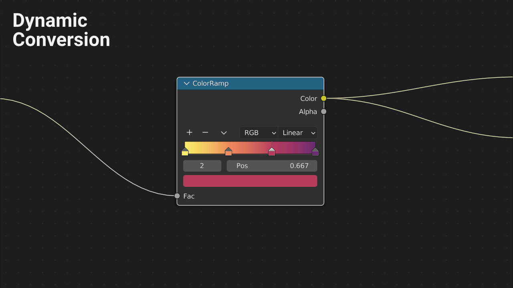

 

# Color Ramp Converter
 is a <a href="https://www.blender.org/" target="_blank">Blender</a> addon that generates custom <a href="https://docs.blender.org/manual/en/latest/interface/controls/nodes/groups.html" target="_blank">node groups</a> from <a href="https://docs.blender.org/manual/en/latest/render/shader_nodes/converter/color_ramp.html" target="_blank">color ramp nodes</a>, making a few parameters more accessible.
Read more: <a href="https://colorrampconverter.readthedocs.io/en/latest/" target="_blank">Documentation</a> 

# Releases are Available:

- ## 🛒 on <a href="https://davidelek.gumroad.com/l/colorrampconverter" target="_blank">Gumroad</a>

- ## 🛒 on <a href="https://blendermarket.com/products/colorrampconverter" target="_blank">Blender Market</a>

- ## 🛒 on <a href="https://www.artstation.com/a/20894561" target="_blank">Artstation</a>

# Features

- Quickly convert between custom node group solution and color ramp node.

    
    
- Connected links are managed automatically by the addon.

- The created node group is NOT dependent on the addon.
Additional features like that may be added as experimental options.

- Map range node based node group setup.
    
    

- Constant interpolation type support with a different node group setup.

    

- Automatically add extra nodes of chosen type to the color inputs of custom node groups.
    
    

- Remove extra nodes when converting back to color ramp node (optional) 

- The custom node group can accept any color input, not just color nodes specifically.

    

- Shader editor support

- Compositor editor support

- Geometry node editor support

- <a href="https://colorrampconverter.readthedocs.io/en/latest/" target="_blank">Documentation</a> 

# Workflow

- Use color ramp nodes initially due to their intuitive controls.

- Convert to a custom node group to obtain additional control.

- Effortlessly convert back from node group to color ramp node if necessary.