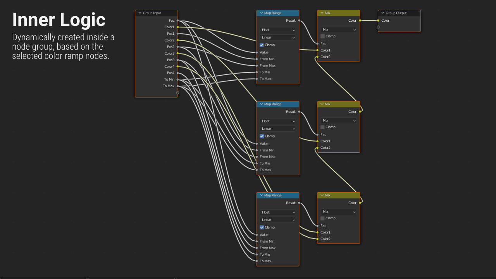

#########
Features
#########

Convert Color Ramp
-------------------
Quickly convert between custom node group solution and color ramp node.

.. image:: images/dynamic_conversion_feature.gif
   :alt: Dynamic conversion feature

.. note::
    Connected links are managed automatically by the addon

Node Group Logic
-----------------

Add Extra Nodes
--------------------------
Automatically add extra nodes of chosen type
to the color inputs of custom node groups.

.. image:: images/extra_nodes_feature.gif
   :alt: Auto add extra nodes feature

.. note::
    Remove extra nodes when converting back to color ramp node (optional)

Panel Settings / Addon Preferences
-----------------------------------
|Settings| to adjust a few aspects of the add-on.

.. |Settings| replace:: :ref:`settings:Settings`

Shader editor support
----------------------
Color Ramp Converter is designed for the shader editor.

Compositor editor support
---------------------------
Although the color ramp converter is designed for the shader editor,
it can be used in the compositor editor as well.

Geometry node editor support
-----------------------------
Although the color ramp converter is designed for the shader editor,
it can be used in the geometry node editor as well.
