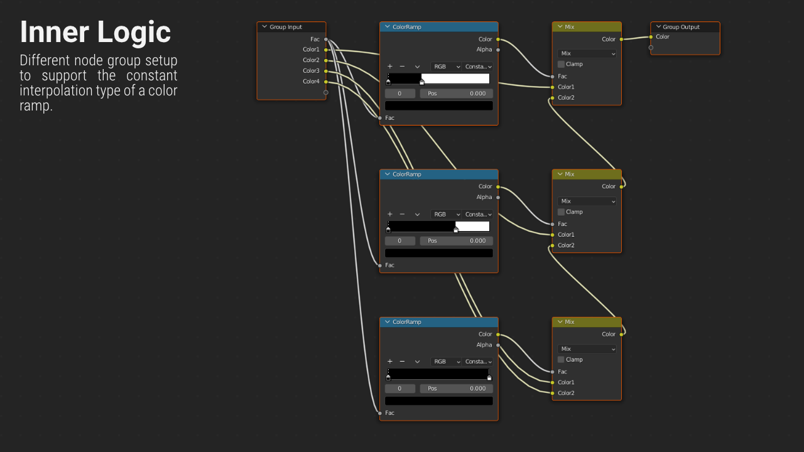

#########
Features
#########

Convert Color Ramp
-------------------
Quickly convert between custom node group solution and color ramp node.

.. image:: images/dynamic_conversion_feature.gif
   :alt: Dynamic conversion feature

.. note::
    Connected links are managed automatically by the addon

Addon Independent Node Groups
------------------------------
The created node group is NOT dependent on the addon.
Additional features like that may be added as experimental options.

Node Group Logic
-----------------
.. image:: images/node_group_inside.png
   :alt: Node Group Logic

Map range node based node group setup.

Constant interpolation type support with a different node group setup.

Add Extra Nodes
--------------------------
Automatically add extra nodes of chosen type
to the color inputs of custom node groups.

.. image:: images/extra_nodes_feature.gif
   :alt: Auto add extra nodes feature

.. note::
    Remove extra nodes when converting back to color ramp node (optional)

Any Color Input
----------------
The custom node group can accept any color input,
not just color nodes specifically.

.. image:: images/color_input.gif
   :alt: Addon independent feature

Panel Settings / Addon Preferences
-----------------------------------
|Settings| to adjust a few aspects of the addon.

.. |Settings| replace:: :ref:`settings:Settings`

Shader editor support
----------------------
Color Ramp Converter is designed for the shader editor.

Compositor editor support
---------------------------
Although the color ramp converter is designed for the shader editor,
it can be used in the compositor editor as well.

Geometry node editor support
-----------------------------
Although the color ramp converter is designed for the shader editor,
it can be used in the geometry node editor as well.
