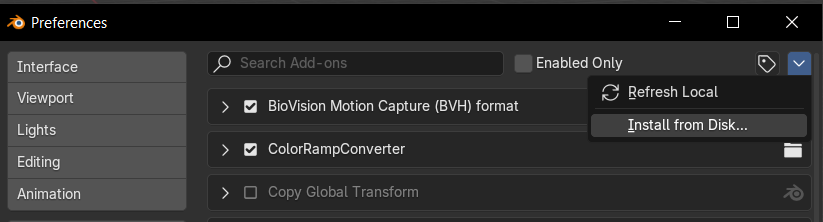
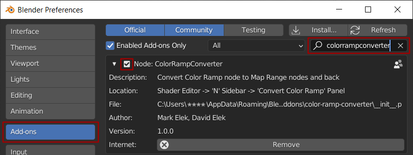
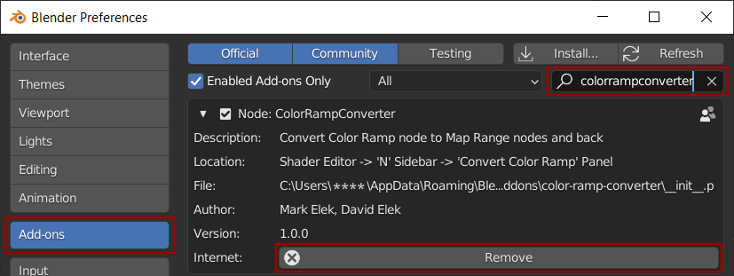

#############
Installation
#############

Blender 4.3 and above
----------------------

The location of the install button has changed in Blender 4.3 and above:

More info:
https://docs.blender.org/manual/en/latest/editors/preferences/addons.html#installing-legacy-add-ons

First Installation
------------------

#. Go to *Edit* -> *Preferences*.
#. Select the *Add-ons* tab on the left if it is not already.
#. Select the *Install...* button along the top. This will open a file dialog.
#. Go to where you have downloaded **ColorRampConverter_version.zip** file.
#. Then, click the *Install add-on from file* button.
#. Search for the add-on by typing *colorrampconverter* in the search box.
#. Make sure the checkbox next to this Add-on is ticked:

Upgrade
-------

If you have previously installed the add-on:

#. Go to *Edit* -> *Preferences*.
#. Select the *Add-ons* tab on the left if it is not already.
#. Search for the add-on by typing *colorrampconverter* in the search box.
#. Select the *Remove* button for this add-on.
#. Restart Blender
#. Follow steps in Clean Installation.

Installation Issues
--------------------

Find the folder where Blender places the addon files, something like:

"C:\\Users\\[YOURUSERNAME]\\AppData\\Roaming\\Blender Foundation\\Blender\\[YOURBLENDERVERSION]\\scripts\\addons"

**Make sure this addon's folder has this exact name: color-ramp-converter**
