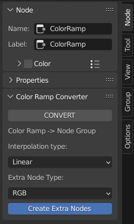
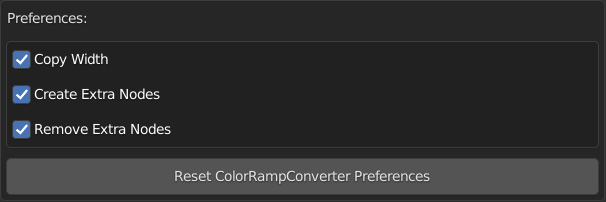

#########
Settings
#########

Convert
-------
Button to convert selected color ramps to custom node groups and vice versa.

.. note:: Add this to quick favorites for easy access by right clicking on the button and selecting 'Add to Quick Favorites'.

.. note:: Press 'Q' to open the quick favorites menu, select 'CONVERT'.

.. warning:: Select nodes to convert!

Interpolation Type
------------------
Defines the interpolation type for the Map Range nodes within converted Color Ramp node groups. 
This applies when the Color Ramp interpolation type is **NOT** set to Constant.

Extra Node Type
---------------
Chose the type of extra nodes.

Create Extra Nodes (AddonPref)
---------------------------------
Create extra nodes for the converted node group's inputs.

.. note:: This option is an addon preference, exposed here for convenience.

##################
Addon Preferences
##################

| You can adjust a few aspects of the addon by going to:
| *Edit -> Preferences -> Add-ons -> expand ColorRampConverter* entry.

Copy Width
-----------

Copy the width of initial node or node group.

Create Extra Nodes
------------------

Create extra nodes for the converted node group's inputs.

Remove Extra Nodes
------------------

Remove extra nodes when converting back to color ramp.

Reset Preferences
-----------------

Reset ColorRampConverter's preferences to default values.

